# Using NIMA  as an Aesthetic Critic for Generated Designs

The notebook is divided into two sections:
- **Section 1 - NIMA Pytorch** Reproduces the paper [NIMA: Neural Image Assessment](https://ieeexplore.ieee.org/document/8352823) which uses deep learning to aesthetically evaluate images as explained in this [blog post](https://ai.googleblog.com/2017/12/introducing-nima-neural-image-assessment.html). 

- **Section 2 - Deploy Model as an Aesthetic Critic** Adapts and evaluates the model for use as an aesthetic critic to evaluate designs generated by genetic algorithms. 

The results of the notebook are summarized below.

## Section 1) NIMA Pytorch

### Datasets

The primary dataset is [Aesthetic Visual Analysis](https://github.com/imfing/ava_downloader) (AVA)  which contains 255510 images with aesthetic ratings of photos scraped from the photo competition website [dpchallenge.com](https://www.dpchallenge.com/)

The paper used two other smaller datasets; Tampere Image Database 2013 (TID2013) and LIVE In the Wild Image Quality Challenge Database which will not be used. The paper itself found:

>We believe this observation shows that NIMA models trained on AVA can generalize to other test examples more effectively, whereas training on TID2013 results in poor performance on LIVE and AVA test sets.

The AVA dataset is not in the official collection of torch datasets so we must write our own data loader. Because we focus on aesthetics we have to be careful not to apply data augmentation that might reduce  the aesthetics, keeping only horizontal flip. We'll also crop landscape/portrait images to accommodate the model's preference for square images.

### Model

The paper tested three pretrained image classification models with the final layer converted for score prediction. The models were: VGG16, Inception-v2, and MobileNet. It found Inception-v2 gave the slightly better results (accuracy of 81.51% vs 80.36%) but that MobileNet was twice as fast. We'll go with MobileNet as the huge speed gain trumps the slight accuracy deficit in production.

### Loss Function

One insight of the paper was to use an Earth Movers Distance(EMD) loss function to better approximate the complexities of images that have high standard deviations. For example, an image scoring low with a high standard deviation, is better than an image scoring low with a low deviation. The high deviation indicates it is a controversial image which some people like and some dislike.

Pytorch does not have this loss built-in (and recommends not using it for [point clouds](https://github.com/facebookresearch/pytorch3d/issues/211) ) so you need to implement your own, with a little help from the [internet](https://discuss.pytorch.org/t/implementation-of-squared-earth-movers-distance-loss-function-for-ordinal-scale/107927)

### Results

The fist phase, just training the final layer reached a loss of 4.5, in the second phase, training the full model, loss reached: 2.5
The accuracy (below) matches the paper very well, right near 80%. Note that the paper only computed accuracy for binary classification; whether the picture was good or bad (score over 5 or below).

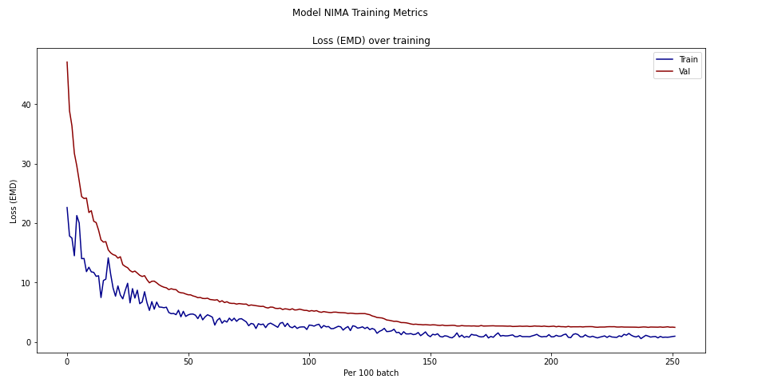</img>

TEST Model on Validation Dataset, ground truth scores (t) and predicted scores (p)  
- green=match (score diff <.5)
- orange=difference < 1
- red=difference > 1

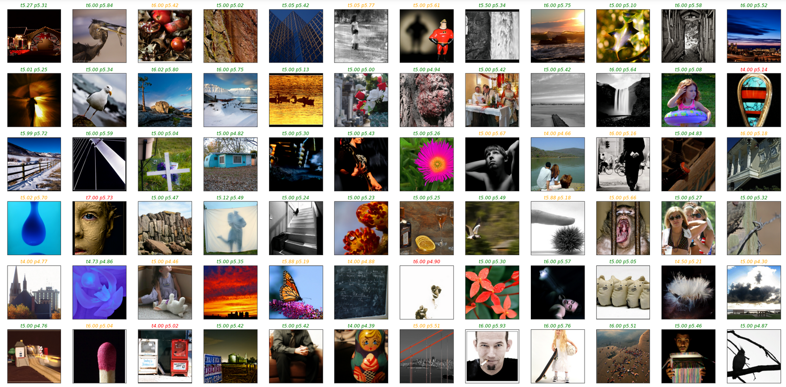

  

## Section 2) Deploy Model as an Aesthetic Critic

In this section the trained model is tested as a design critic using shapes from [Genolve](https://www.genolve.com),  where you can use an online editor to make web graphics, banners, slide shows, music videos and more. A key feature of Genolve is that when you click a shape or design it uses simulated evolution to generate new variations of that shape.  Sometimes these variations look crufty and the goal is to use the NIMA model as an AI critic that will filter out the cruft and only show the good ones to the user.  It worked very well except for some edge cases **where the model prefers the cruft**: 

Here the top scoring designs are distorted (std=standard deviation and p=predicted score):
 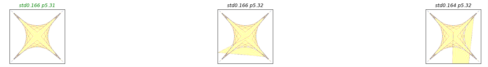</img>
 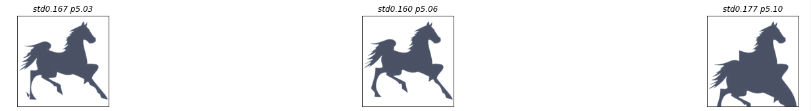</img>

Another problem was liking pure whitespace (tip to photographers, use a lot of whitespace and you'll get a high rating):
 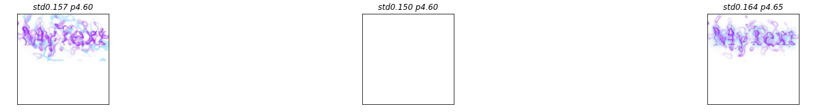</img>

And sometimes a preference for the more boring design:
 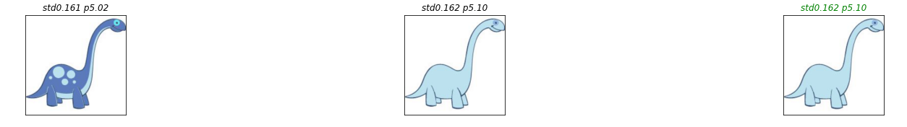</img>

**To help remedy these deficiencies we train with more data.**

###  SAC Dataset
The [Simulacra Aesthetic Captions](https://github.com/JD-P/simulacra-aesthetic-captions) dataset contains images produced from Stable Diffusion runs where users rated the images produced.
To process the data we can re-use the same image loader used for AVA but the ratings require extra processsing:
- Extract from an SQL databasse
- Tabulate into a histogram
- Softmax the histogram

### SAC Results
After training just 1 epoch using the same training loop from AVA at half the learning rate, the binary accuracy is up to 92%.
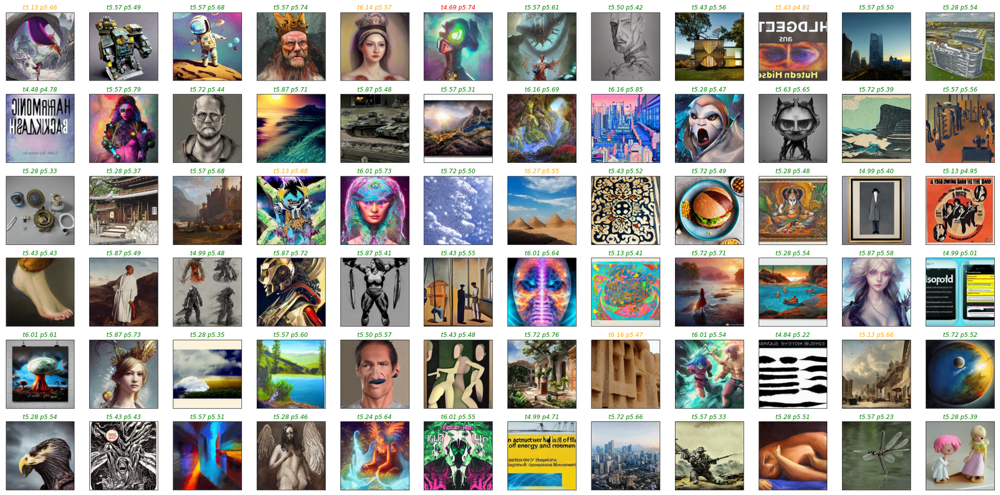

When testing the updated model on Genolve, most earlier deficiencies have resolved:
- The dinosaur kept its spots
- The horse silhouette is correct most of the time
- Blank white squares now score low

However, other concerns have surfaced; the model still likes the mangled star and has poor color taste; choosing a green rimmed heart:
 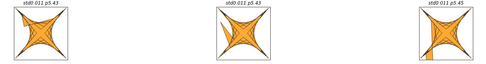</img>
 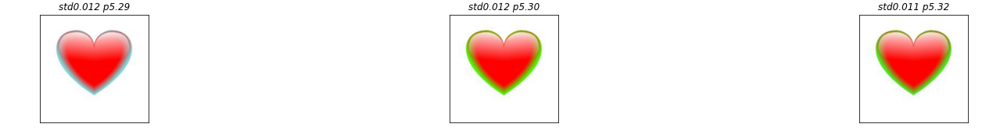</img>
 
### Color Dataset
[Collaborative Filtering of Color Aesthetics](http://www.dgp.toronto.edu/~donovan/cfcolor/cfcolor.pdf) trys to train models to predict the color preferences of individual users. 

To get the dataset
13,343 color
themes were randomly sampled from the Adobe Kuler website. Each theme
was then rated on a scale of 1-5 stars by 40 participants on Amazon’s Mechanical Turk, producing a final dataset of 528,106
individual ratings. 

The ratings are in allMTurkRatings.mat (Mathimatica/Octave) variable testRatings of shape 528106x3 has columns: userid,dataid,rating

The data is inthemeData.mat variable datapoints->rgb  of shape 13343x15  has 13343 color swatches of 5 color patches in 3 rgb values.  This data was converted to image files in a separate process. 

### Color Results
After training for 7 epochs, at half the AVA learning rate, the binary accuracy was 80% while the exact score accuracy was near 50%. This is likely because we chose the higher standard deviation method to convert the scale of 1-5 to a scale of 1-10.
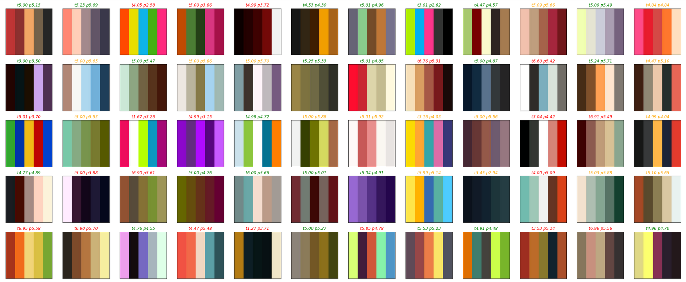

Testing the updated model on Genolve, the poor color sense is now solved. Though color is very subjective, most people would agree that the color combinations of the heart are now ordered correctly from least attractive to most attractive:
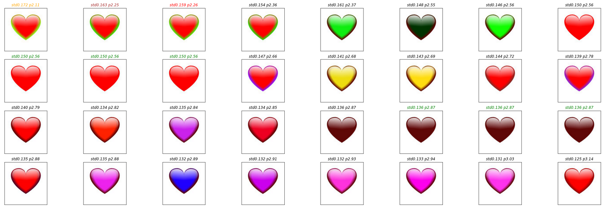
Unfortunatly the star is proving a stubborn one to fix:
 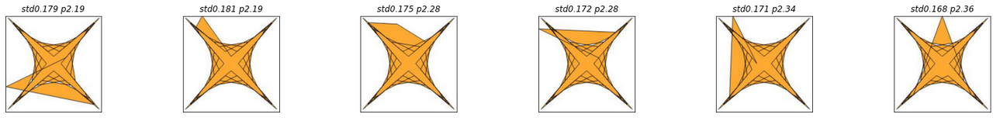</img>
 
### Evolving the Perfect Design or Shape
With the model perfected the genetic algorithm can now run recursively: 
- Evolve a batch of 32 designs 
- The model selects the best one
- Repeat 

Here is the spirelli heart at 10 rounds of evolution with the model automatically selecting the best design for each round:
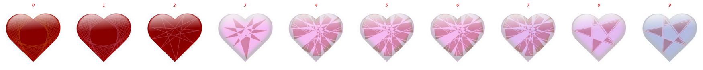

It got stuck from 4-7, a lot of designs were generated but the critic didn't think they were better, but a human may spot a better one such as this one: 

10 rounds of evolution on a stacked trapezoid:
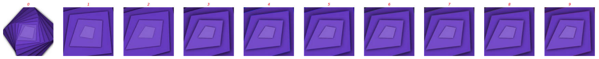

And a similar case here, it got stuck after the 3rd round passing up several neat designs including this one: 
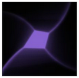

10 rounds of evolution on a landscape:
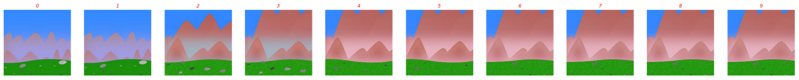

And again choosing a rather plain landscape while alternatives like these were passed by: 
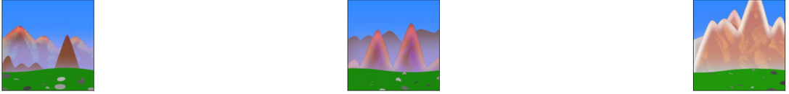
 
### Conclusion
Though the AI critic falls short for unsupervised recursive design, it is still very useful for filtering cruft, spotting duplicates and providing aesthetic feedback to users. To try it out on [Genolve](https://www.genolve.com), just start up the design editor and while you're there ... maybe it is time to change your Twitter or LinkedIn cover photo :)